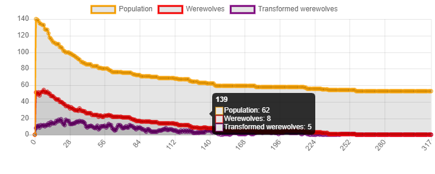
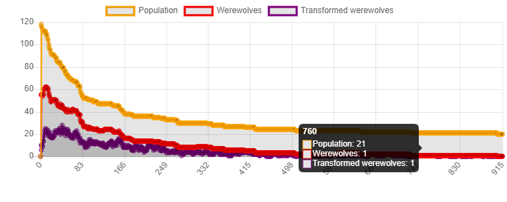

# IA310 - TP1

## Question 1

Pour modifier l'autre agent, on accède à la liste des agents avec ```self.model.schedule.agents``` puis on trouve ceux qui se trouvent à une distance inférieure à 40. Ensuite on accède aux champs ```villager_class``` des agents sélectionnés et on les définit comme ```"Werewolf"```.

Cela semble respecter la notion de _Sociabilité_ de l'agent, c'est à dire la capacité à intéragir avec d'autres agents (définition de Wooldridge, Jenning, Sycara).

## Question 2

Pour les paramètres suivants : 
* 20 villageois
* 5 lycanthropes
* 1 apothicaire
* 2 chasseurs

Le système converge la plupart du temps vers un état où il n'y a plus aucun lycanthrope. En moyenne, il converge aux alentours de 5000-7000 itérations.

Dans ce cas particulier, les lycanthropes transforment la majeure partie des villageois en lycanthropes, puis les chasseurs tuent les lycanthropes une fois qu'ils sont transformés.

La présence de l'apothicaire dans ce cas est insuffisante pour changer significativement la convergence du système : un seul apothicaire ne peut guérir les lycanthropes suffisamment vite comparé à la transformation des villageois par les lycanthropes.

À nombre inchangé des autres espèces :
* Plus il y a de villageois, plus le système met longtemps à converger (plus de lycanthropes une fois attaqués, donc plus de lycanthropes à tuer par les chasseurs)
* Plus il y a de lycanthropes, plus les villageois se font contaminer vite, mais cela ne semble pas changer significativement la vitesse de convergence.
* Le nombre d'apothicaires ne semble pas changer significativement la vitesse de convergence (il y aura moins de lycanthropes à tuer par les chasseurs, ce qui accélère la convergence, mais ils seront plus difficiles à attraper puisqu'il y en a moins, ce qui ralentit la convergence), sauf si il y a tellement d'apothicaires que les villageois guérrissent plus vite qu'ils ne se transforment en lycanthropes. Dans ce cas le système convergera rapidement vers un état où il n'y a plus que des villageois, des apothicaires et des chasseurs.
* Plus il y a de chasseurs, plus les lycanthropes meurent vite, ce qui accélère la convergence.

## Question 3

On observe comme prévu que le nombre de lycanthropes augmente, puis que leur nombre diminue jusqu'à 0 lorsque les lycanthropes transformés sont tués par les chasseurs.

## Question 4

On constate que le nombre initial de villageois et de lycanthropes ne change pas beaucoup le temps avant la convergence : la population de lycanthropes suit une loi qui ressemble à une exponentielle décroissante une fois que tous les villageois sont contaminés (plus il y a de lycanthropes, plus leur population diminue rapidement et inversément).

Sauf dans le cas où le nombre d'apothicaires est énorme, le nombre d'apothicaires change peu le temps de convergence. Les apothicaires font diminuer artificiellement le nombre de lycanthropes, ce qui les rend plus difficile à éliminer pour les chasseurs.

Comme prévu, le temps de convergence diminue si le nombre de chasseurs augmente.

50 villageois, 50 lycanthropes, 5 apothicaires, 35 chasseurs

50 villageois, 50 lycanthropes, 5 apothicaires, 15 chasseurs

## Question 5

On peut conjecturer que la population de lycanthropes suit une loi semblable à une loi exponentielle, et que son paramètre est surtout défini par le nombre de chasseurs. Donc que les chasseurs sont le seul paramètre influant significativement sur le nombre de tours avant la convergence.

## Question 6

| n_villagers | n_werewolves | n_clerics | n_hunters | Run | Population | Transformed werewolves | Werewolves |
|-------------|--------------|-----------|-----------|-----|------------|------------------------|------------|
| 50          | 5            | 0         | 1         | 0   | 42         | 19                     | 41         |
| 50          | 5            | 1         | 1         | 1   | 44         | 21                     | 39         |
| 50          | 5            | 2         | 1         | 2   | 38         | 11                     | 34         |
| 50          | 5            | 3         | 1         | 3   | 49         | 21                     | 41         |
| 50          | 5            | 4         | 1         | 4   | 47         | 21                     | 36         |
| 50          | 5            | 5         | 1         | 5   | 49         | 15                     | 37         |

## Question 7

Ces données ne montrent pas une variation significative du nombre de lycanthrope en fonction du nombre d'apothicaires. Le nombre d'apothicaires est soit trop insuffisant, ou bien le nombre d'itérations, ou de répétitions de l'expérience sont trop insuffisants pour pouvoir conclure sur l'influence du nombre d'apothicaires.

Il faudrait recommencer l'expérience, soit avec plus d'apothicaires, soit avec un plus grand nombre d'itérations dans les simulations, soit réaliser un grand nombre de fois l'expérience et prendre la moyenne des nombres obtenus pour pouvoir conclure.