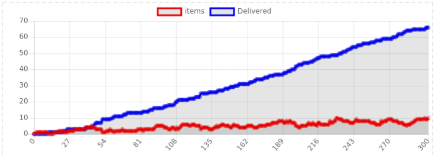
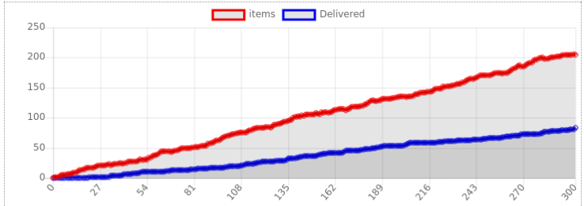
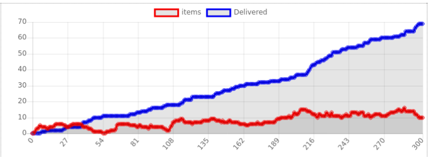
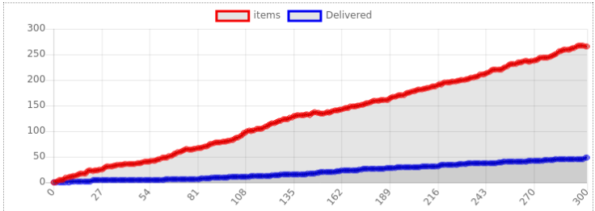

# TP2 Planet Delivery

Effectué par Quentin KREMPP et Arthur LIU

## Question 1

La taxonomie de l'environnement peut se décrire ainsi :
* **Inaccessible** car certains agents ont une information incomplète sur l'environnement : les vaisseaux ne connaissent pas les objets à transporter.
* **Déterministe** car l'action des vaisseaux sur les planètes et inversement n'est pas stochastique.
* **Non épisodique** car le système ne revient pas régulièrement à l'état de départ.
* **Statique** car les changement du système ne dépendent que des agents et non d'autres facteurs extérieurs.
* **Continu** car les positions des vaisseaux sont continues, et on ne peut donc pas dénombrer le nombre d'états possibles du système.

## Question 2

La classe ```Item``` n'hérite pas de la classe ```Agent``` de Mesa car les ```Item``` sont incapables d'intéragir avec l'environnement sans l'aide des autres agents (```Ship```, ```PlanetManager```). Le principe d'autonomie des agents n'est donc pas respecté.

## Question 3

Il existe deux cas de figure :
* Il y a suffisamment de vaisseaux par rapport au nombre de planètes et les vaisseaux sont capables de livrer suffisamment vite pour compenser le nombre de nouveaux objets à livrer. Le nombre de biens présents dans le système devient constant en moyenne.
* Il n'y a pas assez de vaisseaux par rapport au nombre de planètes et ils ne peuvent alors pas livrer assez rapidement pour compenser le nombre croissant d'objets à livrer. Le nombre de biens présents dans le système augmente linéairement.

Dans tous les cas le nombre de biens livrés augmente linéairement avec une pente proportionnelle au nombre de vaisseaux.

Voici deux cas extrêmes :

30 vaisseaux et 5 planètes

5 vaisseaux et 20 planètes

## Question 4

Les agents cherchent à livrer le plus efficacement les biens et ne sont pas en compétition. L'organisation est donc une **coopération**.

## Question 5

Il y a deux changements par rapport à l'environnement précédent :
* Il est maintenant **dynamique** car il y a des changements de l'environnement qui ne dépendent pas de l'agent. Les routes changent d'état sans aucune action de l'agent.
* Il est également **stochastique** puisque le changement des routes est probabiliste et non déterministe.

## Question 6

L'agent est capable de ne considérer seulement les routes accessibles pour choisir les livraisons possibles. Il change également sa vitesse en fonction de l'état de la route.

Cette adaptation est liée à la caractéristique d'**adaptabilité** de l'agent.

## Question 7

Voici à nouveau les deux cas extrêmes avec des paramètres identiques à la **Question 2** :

30 vaisseaux et 5 planètes

5 vaisseaux et 20 planètes

On observe des tendances similaires aux courbes de la **Question 2**, cependant il y a quelques différences dans les détails.

On observe des plateaux dans le premier cas car il n'y a pas beaucoup de routes et lorsque une route est bloquée, les vaisseaux peuvent être bloqués sur leur planète , ce qui empêche les livraisons tant que la route n'est pas réparée.

Dans le deuxième cas, les courbes sont similaires, sauf au niveau du nombre d'objets livrés (quasiment deux fois moins qu'avant), ce qui s'explique par l'état dégradé des routes qui ralentit les livraisons.